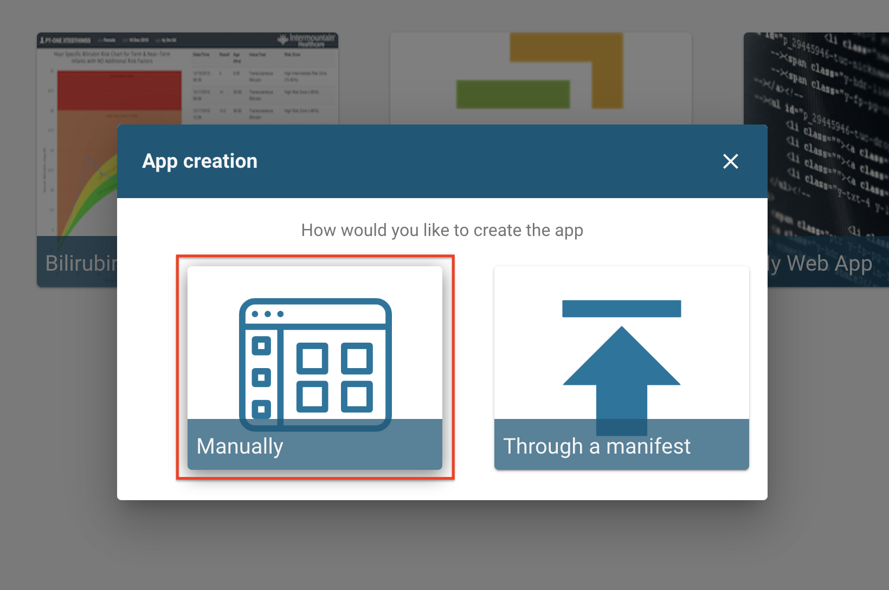
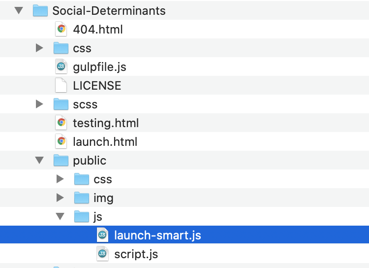

# Social Determinants SMART on FHIR App
This app is a prototype that demonstrates how social determinants of health can be collected and utilized within an EHR. The app uses LOINC's [PRAPARE questionnaire](https://loinc.org/93025-5/) as well as the Bootstrap [SB-Admin-2](https://github.com/BlackrockDigital/startbootstrap-sb-admin-2) template.

## 1. Create a SMART on FHIR sandbox
This app was developed using an [HSPC Logica Sandbox](https://sandbox.logicahealth.org/), create an account and then create a new sandbox making sure that you use FHIR version R4, allow an open FHIR endpoint, and import sample patients, practitioners, and applications.

### Add the PRAPARE Questionnaire resource to your sandbox

Select the "Data Manager" option on the sidebar

Selecting "IMPORT" and then "LOAD FROM FILE"

Upload the <i>PRAPARE.json</i> file found in this repo

### Register this app with your sandbox

Select the "Apps" option on the sidebar

Select the option to "Manually" create the app

On the details page, give the app a name and ensure that the "Public Client" option is selected. Enter the following parameters as shown below:

App Launch URI: <code>http://localhost:3000/launch.html</code> 
App Redirect URI: <code>http://localhost:3000/</code> 
Scopes: <code>launch patient/\*.\*</code>

After saving, you will be given a client ID.

Copy this ID and open the file <i>public/js/launch-smart.js</i>.

At the top of this file you will see:  <code>let client = "REPLACE-WITH-CLIENT-ID-FROM-SANDBOX"</code> 
Paste the ID there so that it looks something like this (but with your ID): 
<code>let client = "2a10ffeb-eb67-45a9-aa9e-5ebfd28297c6"</code>  Save the file

## 2. Install Docker
This example uses Docker, the links below can help you get Docker installed.
* Mac users: https://www.docker.com/products/docker-desktop
    * Follow installer
* Windows users: https://github.com/docker/toolbox/releases
    * Download latest .exe file
    * Follow installer

## 3. Start the app server
Open the terminal app (Mac) or the Docker terminal (Windows), go to the home directory of this project.

Launch the server with the command <code>docker-compose -p <i>projectName</i> up --build &</code>

Additional Docker commands if needed:
* View server output: <code>docker logs <i>projectName</i>\_app_1</code>
* Stop server: <code>docker stop <i>projectName</i>\_app_1</code>
* Start server again: <code>docker start <i>projectName</i>\_app_1</code>
* To wipe a previous build if you want to start over:
    * <code>docker stop <i>projectName</i>\_app_1</code>
    * <code>docker rm <i>projectName</i>\_app_1</code>
    * <code>docker rmi <i>projectName</i>\_app</code>
    * <code>docker volume prune</code>

It will open your browser with a blank view of the app, you can close this since we will be SMART launching from the sandbox the way it would in an EHR.

## 4. Perform a SMART launch from your sandbox
Select the "Apps" option on the sidebar

Launch this app (which you registered earlier)

Select a patient, this example will use the first.

An authorization screen will ask for approval of the app. This is part of a SMART launch and necessary for launching into a secure EHR environment.

The app will then pull up with a summary for the selected patient. Since this is a fresh sandbox, none of your patients will have taken the questionnaire. The map also won't work because the sample patients don't have real addresses. Select the option on the sidebar to take the PRAPARE questionnaire for this patient.

Your response will be saved to the sandbox upon completion and will redirect to a populated the summary page. Remembere that <b>each question must be answered</b>, so the app will prompt you to finish if you skip a field. If you enter a real address in the questionnaire, the map will render that new address rather than the original fake one.

